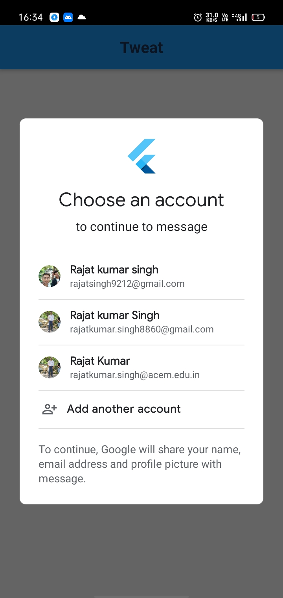

#message

This is a messaging app build with flutter and firebase.
Here user can login with email id and users can chat with each other by sending text messages and user can also send
local gif and images,you can also view image in fullscreen. 

Want to Use App !!

Follow following steps:

1.Clone or download this repository.
2.Open this folder in Android Studio.
3.Click on run button and you are ready to use this app.

#You can also install this app using apk
 
 
For apk go to location 'build\app\outputs\flutter-apk'

 
 
1.First Screenshot
 

 
 
2.Second Screenshot
 

 
 
3.Third Screenshot
 

 
 
4.Fourth Screenshot
 

